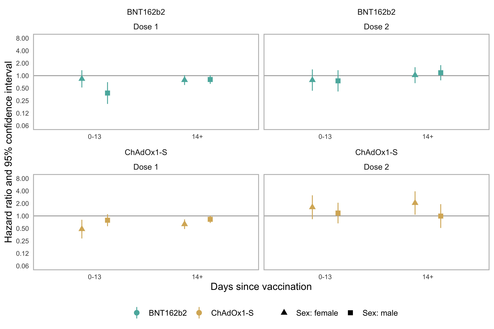
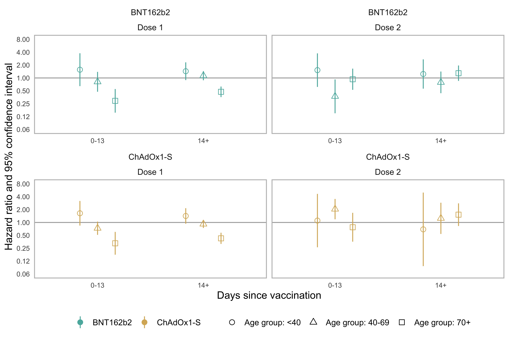
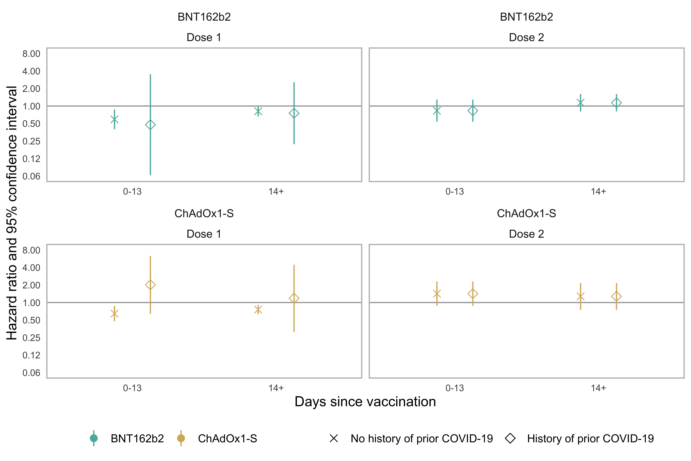

```{r setup, include=FALSE}
knitr::opts_chunk$set(echo = FALSE)

doses <- data.table::fread("../output/doses.csv")

df <- data.table::fread("../output/estimates.csv")
df$nation <- factor(df$nation, levels = c("All","England","Wales"))
df$dose <- factor(df$dose, levels = c("Dose 1","Dose 2"))
df$age_group <- factor(df$age_group, levels = c("All","<40","40-69","70+"))
df$sex <- factor(df$sex, levels = c("All","Male","Female"))
df$exposure <- factor(df$exposure, levels = c("BNT162b2","ChAdOx1-S"))
df$term <- ifelse(df$term=="day0_14","0-13","14+")
df$term <- factor(df$term, levels = c("0-13","14+"))

df1 <- data.table::fread("../output/waldtests.csv")
df1$p.value <- ifelse(df1$p.value<0.005,"<0.005",sprintf("%.2f",df1$p.value))

df2 <- data.table::fread("../output/counts.csv")
df2 <- df2[df2$outcome=="Myocarditis",]
df2[,c("outcome","prior_covid")] <- NULL

```

\newpage

# Supplementary Figure 1: Patient age distribution

TO BE UPDATED

\newpage 

# Supplementary Figure 2: Dose 1 replication in Wales

TO BE UPDATED

\newpage

# Supplementary Figure 3: Interactions, by sex

```{r echo=FALSE, results = 'asis', out.width="90%"}

```

\newpage

# Supplementary Figure 4: Interactions, by age group

```{r echo=FALSE, results = 'asis', out.width="90%"}

```

\newpage

# Supplementary Figure 5: Estimates, by prior history

```{r echo=FALSE, results = 'asis', out.width="90%"}

```

\newpage

# Supplementary Figure 6: Estimates for pericarditis

```{r echo=FALSE, results = 'asis', out.width="90%"}
knitr::include_graphics("../output/figure_Pericarditis.jpeg")
```

\newpage

# Supplementary Table 1a: Estimates, dose 1

```{r overall_dose1}
tmp <- df[df$dose=="Dose 1" & df$nation=="England" & df$sex=="All" & df$prior_covid=="All" & df$outcome=="Myocarditis" & df$age_group=="All",
          c("exposure","term","estimate","conf.low","conf.high","p.value")]

tmp <- merge(tmp, df2[df2$dose=="Dose 1",], by = c("exposure","term"), all.y = TRUE)
tmp$estimate <- ifelse(tmp$term=="Before",1,tmp$estimate)
tmp$conf.low <- ifelse(tmp$term=="Before","",paste0(round(tmp$conf.low, 2)))
tmp$conf.high <- ifelse(tmp$term=="Before","",paste0(round(tmp$conf.high, 2)))
tmp$p.value <- ifelse(tmp$term=="Before","",paste0(round(tmp$p.value, 2)))
tmp$term <- factor(tmp$term, levels = c("Before","0-13","14+"))
tmp$dose <- NULL

knitr::kable(tmp[order(tmp$exposure,tmp$term),], digits=2)
```

# Supplementary Table 1b: Estimates, dose 2

```{r overall_dose2}
tmp <- df[df$dose=="Dose 2" & df$nation=="England" & df$sex=="All" & df$prior_covid=="All" & df$outcome=="Myocarditis" & df$age_group=="All",
          c("exposure","term","estimate","conf.low","conf.high","p.value")]

tmp <- merge(tmp, df2[df2$dose=="Dose 2",], by = c("exposure","term"), all.y = TRUE)
tmp$estimate <- ifelse(tmp$term=="Before",1,tmp$estimate)
tmp$conf.low <- ifelse(tmp$term=="Before","",paste0(round(tmp$conf.low, 2)))
tmp$conf.high <- ifelse(tmp$term=="Before","",paste0(round(tmp$conf.high, 2)))
tmp$p.value <- ifelse(tmp$term=="Before","",paste0(round(tmp$p.value, 2)))
tmp$term <- factor(tmp$term, levels = c("Before","0-13","14+"))
tmp$dose <- NULL

knitr::kable(tmp[order(tmp$exposure,tmp$term),], digits=2)
```

\newpage

# Supplementary Table 2: Dose 1 replication in Wales 

TO BE UPDATED

\newpage

# Supplementary Table 3: Interactions, by age group

```{r age_group}
tmp <- df[df$dose=="Dose 1" & df$nation=="England" & df$sex=="All" & df$prior_covid=="All" & df$outcome=="Myocarditis" & df$age_group!="All",
          c("age_group","dose","exposure","estimate","conf.low","conf.high","p.value")]
knitr::kable(tmp[order(tmp$age_group,tmp$dose,tmp$exposure),], digits=2)
```

\newpage

# Supplementary Table 4: Interactions, by sex

```{r sex}
tmp <- df[df$sex!="All" & df$prior_covid=="All" & df$nation=="England" & df$age_group=="All" & df$outcome=="Myocarditis",
          c("sex","dose","exposure","estimate","conf.low","conf.high","p.value")]
knitr::kable(tmp[order(tmp$sex,tmp$dose,tmp$exposure),], digits=2)
```

\newpage

# Supplementary Table 5a: Heterogeneity p-values, dose 1

TO BE UPDATED

# Supplementary Table 5b: Heterogeneity p-values, dose 2

TO BE UPDATED

\newpage

# Supplementary Table 6: Estimates, by prior history

```{r prior_history}
tmp <- df[df$sex=="All" & df$prior_covid!="All" & df$nation=="England" & df$age_group=="All" & df$outcome=="Myocarditis",
          c("prior_covid","dose","exposure","estimate","conf.low","conf.high","p.value")]
knitr::kable(tmp[order(tmp$prior_covid,tmp$dose,tmp$exposure),], digits=2)
```

\newpage

# Supplementary Table 7: Estimates for pericarditis

```{r outcomes}
tmp <- df[df$sex=="All" & 
            df$prior_covid=="All" & 
            df$nation=="England" & 
            df$age_group=="All" & 
            df$outcome=="Pericarditis" &
            df$extended_fup==FALSE,
          c("dose","exposure","term","estimate","conf.low","conf.high","p.value")]
knitr::kable(tmp[order(tmp$dose,tmp$exposure),], digits=2)
```